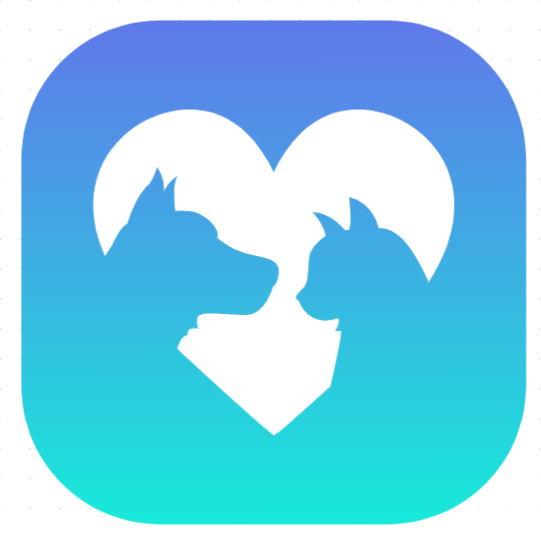

<p align="center">
<a href="https://github.com/Byakugan-Team/Pinder/">
    
  </a>
   <a href="https://github.com/Byakugan-Team/Pinder/">
    
  </a>
  
  <a href="#Contributing">
    
  </a>
  <a href="https://github.com/Byakugan-Team/Pinder/blob/main/LICENSE">
    
  </a>
</p>

<!-- PROJECT LOGO -->
<br />
<p align="center">
  <a href="https://github.com/Byakugan-Team/Pinder">
    
  </a>

  <h1 align="center" >Pinder</h1>

  <p align="center">
    Have A Pet ? Have A Pinder
    <br />
  </p>
  <p align="center">
  <a href="">
    
  </a>

  <a href="">
    
  </a>
</p>
<p align="center">
    <br />
    <a href="#REST-API">REST API</a>
    ·
    <a href="https://github.com/Byakugan-Team/Pinder/issues">Report Bug</a>
    ·
    <a href="https://github.com/Byakugan-Team/Pinder/issues">Request Feature</a>
  </p>
</p>


<details open="open">
  <summary>Table of Contents</summary>
  <ol>
    <li>
      <a href="#about-the-project">About The Project</a>
      <ul>
        <li><a href="#Features">Features</a></li>
        <li><a href="#built-with">Built With</a></li>
      </ul>
    </li>
    <li>
      <a href="#getting-started">Getting Started</a>
      <ul>
        <li><a href="#prerequisites">Prerequisites</a></li>
        <li><a href="#installation">Installation</a></li>
      </ul>
    </li>
    <li><a href="#usage">Usage</a></li>
    <li><a href="#roadmap">Roadmap</a></li>
    <li><a href="#contributing">Contributing</a></li>
    <li><a href="#REST-API">Contributing</a></li>
    <li><a href="#contact">Contact</a></li>
    <li><a href="#license">License</a></li>
  </ol>
</details>


<!-- ABOUT THE PROJECT -->
## About The Project
Pinder is Mobile Application for Pets Community , Users can sell , buy and share their pets In Pinder 
[![Product Name Screen Shot][product-screenshot]](https://example.com)


### Features
 A few of the things you can do with Pinder:
 
  * Chat with other Users on realtime Using Pinder Chat or Pinder Video Call
  * Share your Pets To Pinder Community with Automatic Pet detection using ML 
  * Explore Other Users Pets For purpose to Buy , looking for a match or Just for Fun 😄

### Built With

* [React Native](https://reactnative.dev)
* [Node JS](https://nodejs.org)
* [Express JS](https://expressjs.com)
* [Mysql](https://www.mysql.com)
* [Python](https://www.python.org)


## Getting Started

### Prerequisites

Pinder Uses Npm For Client Side Application and Docker For Server Side .
* [npm](https://nodejs.org/en/)
  ```sh
  npm install npm@latest -g
  ```
* [Docker](https://www.docker.com/products/docker-desktop)
  ```sh
  docker version
  ```
### Installation

1. Clone the repo
   ```sh
   git clone https://github.com/Byakugan-Team/Pinder.git
   ```
2. Run server Side
    ```sh
     docker-compose up --build
     ```

3. Run Pinder Application
    ```sh
      cd client
    ```

    ```sh
      npm install
    ```

    ```sh
      npm start
    ```


## Usage
Pictures For Applications Here


## Roadmap
Future Features Here


## Contributing

Contributions are what make the open source community such an amazing place to be learn, inspire, and create. Any contributions you make are **greatly appreciated**.

1. Fork the Project
2. Create your Feature Branch (`git checkout -b feature/PinderFeature`)
3. Commit your Changes (`git commit -m 'Add some PinderFeature'`)
4. Push to the Branch (`git push origin feature/PinderFeature`)
5. Open a Pull Request

## REST API
Documentation for REST calls: [REST API](./REST.md)

## Contact

Byakugan Team  - Byakugan-Team@gmail.com

Project Link: [https://github.com/Byakugan-Team/Pinder](https://github.com/Byakugan-Team/Pinder)


## License

Pinder is made available under the <a href="https://github.com/Byakugan-Team/Pinder/blob/main/LICENSE">MIT</a>


